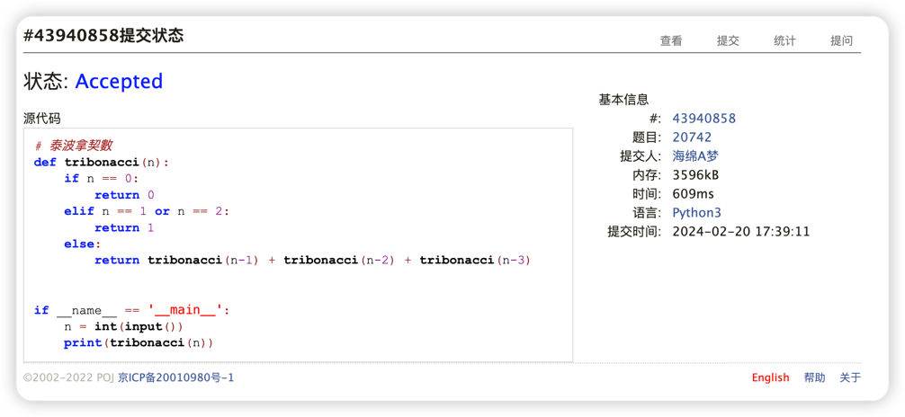
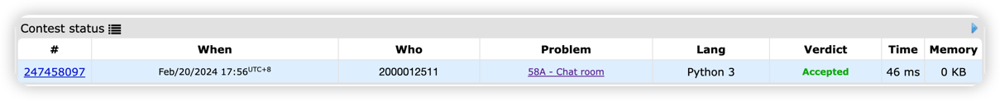
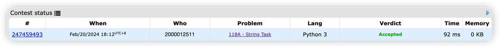
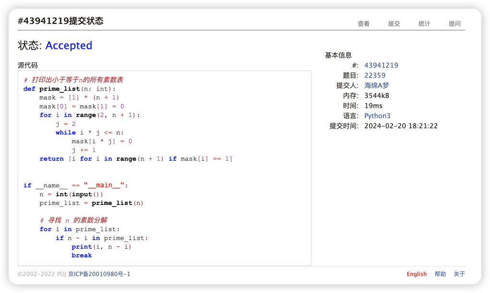
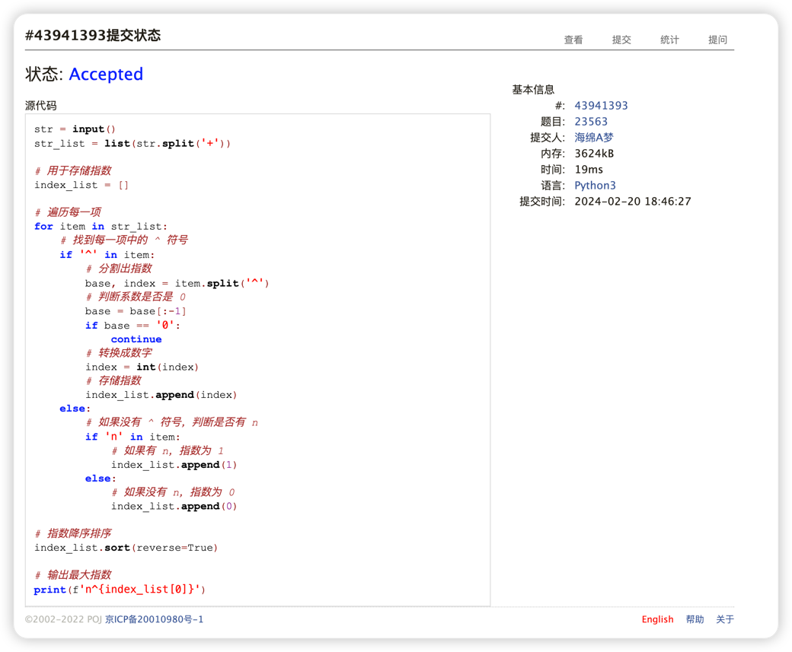
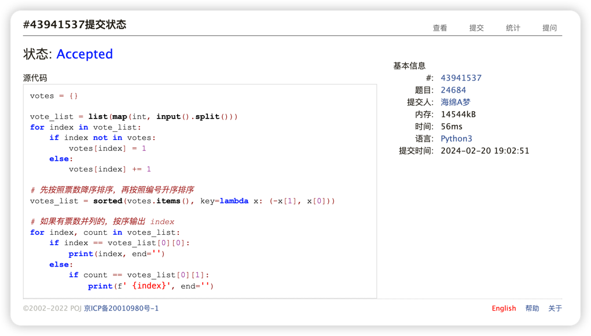

# Assignment #1: 拉齐大家Python水平

Updated 0940 GMT+8 Feb 19, 2024

2024 spring, Complied by ==元培学院 赵浩男==


**说明：**

1）数算课程的先修课是计概，由于计概学习中可能使用了不同的编程语言，而数算课程要求Python语言，因此第一周作业练习Python编程。如果有同学坚持使用C/C++，也可以，但是建议也要会Python语言。

2）请把每个题目解题思路（可选），源码Python, 或者C++（已经在Codeforces/Openjudge上AC），截图（包含Accepted），填写到下面作业模版中（推荐使用 typora https://typoraio.cn ，或者用word）。AC 或者没有AC，都请标上每个题目大致花费时间。

3）课程网站是Canvas平台, https://pku.instructure.com, 学校通知3月1日导入选课名单后启用。**作业写好后，保留在自己手中，待3月1日提交。**

提交时候先提交pdf文件，再把md或者doc文件上传到右侧“作业评论”。Canvas需要有同学清晰头像、提交文件有pdf、"作业评论"区有上传的md或者doc附件。

4）如果不能在截止前提交作业，请写明原因。


**编程环境**

==（请改为同学的操作系统、编程环境等）==

操作系统：macOS Sonoma 14.4 Beta版 (c)

Python编程环境 PyCharm 2023.3.3 (Professional Edition)


## 1. 题目

### 20742: 泰波拿契數

http://cs101.openjudge.cn/practice/20742/


思路：

首先对边界条件进行判断，当n=0时，返回0；当n=1或n=2时，返回1。

当  n>2  时，递归调用 tribonacci(n-1) + tribonacci(n-2) + tribonacci(n-3)。


##### 代码

```python
def tribonacci(n):
    if n == 0:
        return 0
    elif n == 1 or n == 2:
        return 1
    else:
        return tribonacci(n - 1) + tribonacci(n - 2) + tribonacci(n - 3)


if __name__ == '__main__':
    n = int(input())
    print(tribonacci(n))

```


代码运行截图 ==（至少包含有"Accepted"）==



### 58A. Chat room

greedy/strings, 1000, http://codeforces.com/problemset/problem/58/A


思路：

先设定一个指向 hello 中字符的游标i，然后遍历 s，如果找到了 hello 中的字符，i += 1，游标指向下一个字符

如果 i == 5，说明找到了 hello，输出 YES，否则输出 NO。


##### 代码

```python
s = input()

word = "hello"

# 设定一个指向word中字符的游标
i = 0

# 设定一个标志位，用于判断是否找到了hello
flag = False

# 遍历s，如果找到了hello中的字符，i += 1
for j in range(len(s)):
    if s[j] == word[i]:
        i += 1
    if i == 5:
        flag = True
        break

if flag:
    print("YES")
else:
    print("NO")
```


代码运行截图 ==（至少包含有"Accepted"）==



### 118A. String Task

implementation/strings, 1000, http://codeforces.com/problemset/problem/118/A


思路：

现将字符串中的大写字母转换成小写字母，然后去掉字符串中的元音字母

最后在每个辅音字母前加上'.'，要注意在第一个辅音前也要加上'.'


##### 代码

```python
str = input()

# 先转换成小写字母
str = str.lower()

# 去掉元音字母
str = str.replace('a', '')
str = str.replace('e', '')
str = str.replace('i', '')
str = str.replace('o', '')
str = str.replace('u', '')
str = str.replace('y', '')

# 在每个辅音字母前加上'.'
str = '.'.join(str)
# 记得在最前面也要加上'.'
str = '.' + str

# 输出结果
print(str)
```


代码运行截图 ==（AC代码截图，至少包含有"Accepted"）==



### 22359: Goldbach Conjecture

http://cs101.openjudge.cn/practice/22359/


思路：

先打印出小于等于 n 的所有素数表，然后对于每一个素数表元素 i，判断 n - i 是否也素数表中

如果是，则输出 i 和 n - i，然后退出循环。


##### 代码

```python
# 打印出小于等于n的所有素数表
def prime_list(n: int):
    mask = [1] * (n + 1)
    mask[0] = mask[1] = 0
    for i in range(2, n + 1):
        j = 2
        while i * j <= n:
            mask[i * j] = 0
            j += 1
    return [i for i in range(n + 1) if mask[i] == 1]


if __name__ == "__main__":
    n = int(input())
    prime_list = prime_list(n)

    # 寻找 n 的素数分解
    for i in prime_list:
        if n - i in prime_list:
            print(i, n - i)
            break
```


代码运行截图 ==（AC代码截图，至少包含有"Accepted"）==



### 23563: 多项式时间复杂度

http://cs101.openjudge.cn/practice/23563/


思路：

首先将输入的字符串按照 + 分割成列表

然后遍历每一项，找到每一项中的 ^ 符号，分割出指数

如果没有 ^ 符号，判断是否有 n，如果有 n，指数为 1，如果没有 n，指数为 0

然后判断系数是否是 0，如果是 0，跳过这一项，否则将指数存储到 index_list 中

最后对 index_list 进行降序排序，输出最大指数
##### 代码

```python
str = input()
str_list = list(str.split('+'))

# 用于存储指数
index_list = []

# 遍历每一项
for item in str_list:
    # 找到每一项中的 ^ 符号
    if '^' in item:
        # 分割出指数
        base, index = item.split('^')
        # 判断系数是否是 0
        base = base[:-1]
        if base == '0':
            continue
        # 转换成数字
        index = int(index)
        # 存储指数
        index_list.append(index)
    else:
        # 如果没有 ^ 符号，判断是否有 n
        if 'n' in item:
            # 如果有 n，指数为 1
            index_list.append(1)
        else:
            # 如果没有 n，指数为 0
            index_list.append(0)

# 指数降序排序
index_list.sort(reverse=True)

# 输出最大指数
print(f'n^{index_list[0]}')
```


代码运行截图 ==（AC代码截图，至少包含有"Accepted"）==



### 24684: 直播计票

http://cs101.openjudge.cn/practice/24684/


思路：

先将输入的整行字符串按照空格分割成列表

遍历列表，对每一个元素利用字典进行计数

然后对字典按照票数降序排序，再按照编号升序排序

如果有票数并列的，按序输出 index

##### 代码

```python
votes = {}

vote_list = list(map(int, input().split()))
for index in vote_list:
    if index not in votes:
        votes[index] = 1
    else:
        votes[index] += 1

# 先按照票数降序排序，再按照编号升序排序
votes_list = sorted(votes.items(), key=lambda x: (-x[1], x[0]))

# 如果有票数并列的，按序输出 index
for index, count in votes_list:
    if index == votes_list[0][0]:
        print(index, end='')
    else:
        if count == votes_list[0][1]:
            print(f' {index}', end='')

```


代码运行截图 ==（AC代码截图，至少包含有"Accepted"）==



## 2. 学习总结和收获

==如果作业题目简单，有否额外练习题目，比如：OJ“数算pre每日选做”、CF、LeetCode、洛谷等网站题目。==


