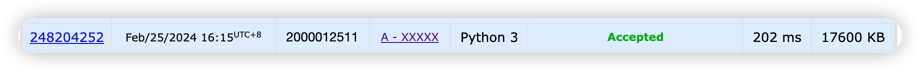

# Assignment #2: 编程练习

Updated 0953 GMT+8 Feb 24, 2024

2024 spring, Complied by ==元培学院 赵浩男==


**说明：**

1）The complete process to learn DSA from scratch can be broken into 4 parts:
- Learn about Time and Space complexities
- Learn the basics of individual Data Structures
- Learn the basics of Algorithms
- Practice Problems on DSA

2）请把每个题目解题思路（可选），源码Python, 或者C++（已经在Codeforces/Openjudge上AC），截图（包含Accepted），填写到下面作业模版中（推荐使用 typora https://typoraio.cn ，或者用word）。AC 或者没有AC，都请标上每个题目大致花费时间。

3）课程网站是Canvas平台, https://pku.instructure.com, 学校通知3月1日导入选课名单后启用。**作业写好后，保留在自己手中，待3月1日提交。**

提交时候先提交pdf文件，再把md或者doc文件上传到右侧“作业评论”。Canvas需要有同学清晰头像、提交文件有pdf、"作业评论"区有上传的md或者doc附件。

4）如果不能在截止前提交作业，请写明原因。


**编程环境**

==（请改为同学的操作系统、编程环境等）==

操作系统：macOS Ventura 13.4.1 (c)

Python编程环境：Spyder IDE 5.2.2, PyCharm 2023.1.4 (Professional Edition)

C/C++编程环境：Mac terminal vi (version 9.0.1424), g++/gcc (Apple clang version 14.0.3, clang-1403.0.22.14.1)


## 1. 题目

### 27653: Fraction类

http://cs101.openjudge.cn/2024sp_routine/27653/


思路：

先通分，然后相加，最后约分。

通分是求分母的最小公倍数，约分是求分子分母的最大公约数。
##### 代码

```python
# 最大公因数
def GCD(x, y):
    if y > x:
        x, y = y, x
    while y != 0:
        x, y = y, x % y
    return x


# 最小公倍数
def LCM(x, y):
    return x * y // (GCD(x, y))


class Fraction:
    def __init__(self, numerator, denominator):
        self.numerator = numerator
        self.denominator = denominator

    def __add__(self, other):
        if isinstance(other, Fraction):
            common_denominator = LCM(self.denominator, other.denominator)
            common_numerator = (common_denominator // self.denominator) * self.numerator + (
                    common_denominator // other.denominator) * other.numerator
            common_factor = GCD(common_numerator, common_denominator)
            result_numerator = common_numerator // common_factor
            result_denominator = common_denominator // common_factor
            return Fraction(result_numerator, result_denominator)


if __name__ == '__main__':
    m, n, x, y = map(int, input().split())
    a = Fraction(m, n)
    b = Fraction(x, y)
    print(f"{(a + b).numerator}/{(a + b).denominator}")


```


代码运行截图 ==（至少包含有"Accepted"）==


### 04110: 圣诞老人的礼物-Santa Clau’s Gifts

greedy/dp, http://cs101.openjudge.cn/practice/04110


思路：

由于可以拆分成任意散装，就不需要动态规划。

直接贪心算法装单价高的即可


##### 代码

```python
n, max_weight = map(int, input().split())
gift_info = {}

for i in range(n):
    value, weight = map(int, input().split())
    value_per_weight = value / weight
    gift_info[f"Gift_{i}"] = [value_per_weight, weight, value]

# 贪心算法，按照单价降序排列
sorted_gift = sorted(gift_info.values(), key=lambda x: x[0], reverse=True)

# 开始装包
current_weight = 0
total_value = 0
for gift in sorted_gift:
    if current_weight <= max_weight:
        if gift[1] <= max_weight - current_weight:
            current_weight += gift[1]
            total_value += gift[2]
        else:
            total_value += gift[0] * (max_weight - current_weight)
            break

print("{:.1f}".format(total_value))
```


代码运行截图 ==（至少包含有"Accepted"）==


### 18182: 打怪兽

implementation/sortings/data structures, http://cs101.openjudge.cn/practice/18182/


思路：

利用字典存放时间和技能表的键值对

对每一时刻的技能表按照伤害降序排列，再按照时间排列所有技能表

然后要注意每一时刻放技能的时候，循环次数不能越界

最大限制技能数和该时刻所有技能数中取最小值进行循环


##### 代码

```python
nCases = int(input())

for _ in range(nCases):
    n, m, b = map(int, input().split())
    skills = {}
    for i in range(n):
        t, x = map(int, input().split())
        if t in skills:
            skills[t].append(x)
        else:
            skills[t] = [x]


    # 对每一时刻的招数进行排序
    for i in skills:
        skills[i].sort(reverse=True)
    # 再按照时间顺序排列
    sorted_skills = sorted(skills.items(), key=lambda x:x[0])

    # 开始打怪兽
    alive = True
    for i in range(len(sorted_skills)):
        for j in range(min(m, len(sorted_skills[i][1]))):
            b -= sorted_skills[i][1][j]
            if b <= 0:
                alive = False
                break
        if not alive:
            print(sorted_skills[i][0])
            break
    if alive:
        print("alive")
```


代码运行截图 ==（AC代码截图，至少包含有"Accepted"）==


### 230B. T-primes

binary search/implementation/math/number theory, 1300, http://codeforces.com/problemset/problem/230/B


思路：

质数打表（详见 def t_prime_set(N)) 

然后将打好的质数平方表转换成 set，查找元素为 O(1) 复杂度


##### 代码

```python
def t_prime_set(N):
    mask = [1] * (N + 1)
    for i in range(2, N + 1):
        # 如果这个是已经不是素数了，它的倍数也一定被筛过了
        if mask[i] == 0:
            continue
        # 只需要从 i * i 开始筛就好，因为 i * j (j < i) 的数已经在前面被 j 筛过了
        j = i
        while i * j <= N:
            mask[i * j] = 0
            j += 1

    return set([i ** 2 for i in range(2, N + 1) if mask[i] == 1])


if __name__ == '__main__':
    t_prime_set = t_prime_set(1000000)
    n = int(input())
    input_nums = list(map(int,input().split()))
    for num in input_nums:
        if num in t_prime_set:
            print("YES")
        else:
            print("NO")
```


代码运行截图 ==（AC代码截图，至少包含有"Accepted"）==


### 1364A. XXXXX

brute force/data structures/number theory/two pointers, 1200, https://codeforces.com/problemset/problem/1364/A


思路：

这 TM 是个数学题

如果给的每个数组都是 hate 的倍数，那么任意子区间都是 hate 的倍数，返回 -1

如果给的数组之和不是 hate 的倍数，那么直接返回 len(nums)

如果数组之和是 hate 的倍数，找到从左向右数第一个不是 hate 倍数的数的索引 x

以及从右向左第一个不是 hate 倍数的数的索引 y

然后比较 n - (x + 1) 和 y，返回较大的那个


##### 代码

```python
t = int(input())

for _ in range(t):
    n, hate = map(int, input().split())
    nums = list(map(int, input().split()))
    # 如果数组的和不是 hate 的倍数，直接返回 n
    if sum(nums) % hate != 0:
        print(n)
    else:
        # x 为第一个不是 hate 倍数的索引，y 是最后一个不是 hate 倍数的索引
        x, y = -1, -1
        # 判断是否都是 hate 的倍数，如果都是，则直接返回 -1
        for i in range(n):
            if nums[i] % hate != 0:
                x = i
                break
            else:
                continue
        # 如果数组中全都是 x 的倍数，即 x 没有改动过，x == -1
        if x == -1:
            print(-1)
        # 从后往前找到最后一个不是 hate 倍数的索引
        else:
            for i in range(n - 1,-1,-1):
                if nums[i] % hate != 0:
                    y = i
                    break
            max_length = max(n - x - 1, y)
            print(max_length)
```


代码运行截图 ==（AC代码截图，至少包含有"Accepted"）==



### 18176: 2050年成绩计算

http://cs101.openjudge.cn/practice/18176/


思路：

质数打表（详见 def t_prime_set(N))

然后将打好的质数平方表转换成 set，查找元素为 O(1) 复杂度

##### 代码

```python
def t_prime_lst(N):
    mask = [1] * (N + 1)
    for i in range(2, N + 1):
        if mask[i] == 0:
            continue
        j = i
        while i * j <= N:
            mask[i * j] = 0
            j += 1
    lst = [i ** 2 for i in range(2, N + 1) if mask[i] == 1]
    return lst


if __name__ == '__main__':
    t_prime_set = set(t_prime_lst(10000))
    m, n = map(int, input().split())
    for _ in range(m):
        valid_score = 0
        scores = list(map(int, input().split()))
        for score in scores:
            if score in t_prime_set:
                valid_score += score
        if valid_score == 0:
            print(0)
        else:
            average_score = valid_score / len(scores)
            print("{:.2f}".format(average_score))
```


代码运行截图 ==（AC代码截图，至少包含有"Accepted"）==


## 2. 学习总结和收获

==如果作业题目简单，有否额外练习题目，比如：OJ“2024spring每日选做”、CF、LeetCode、洛谷等网站题目。==


